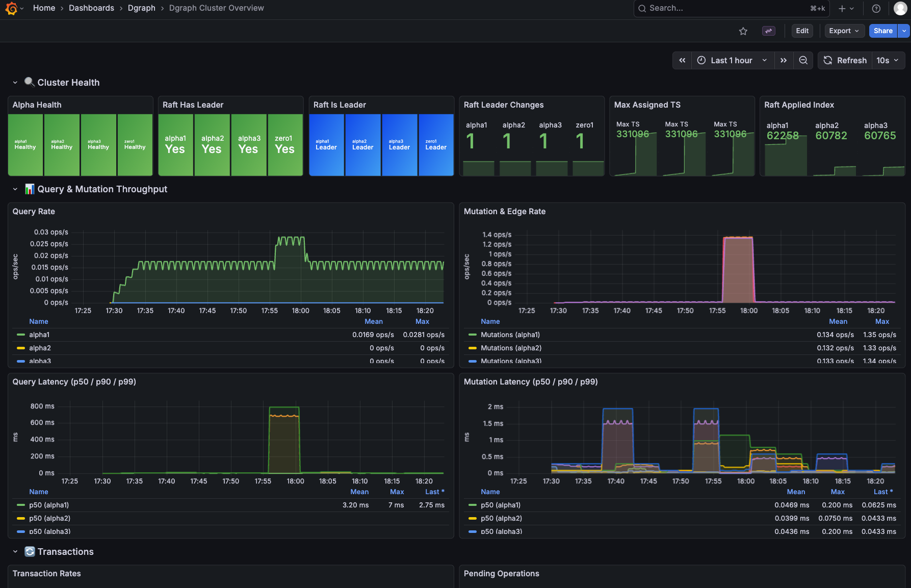
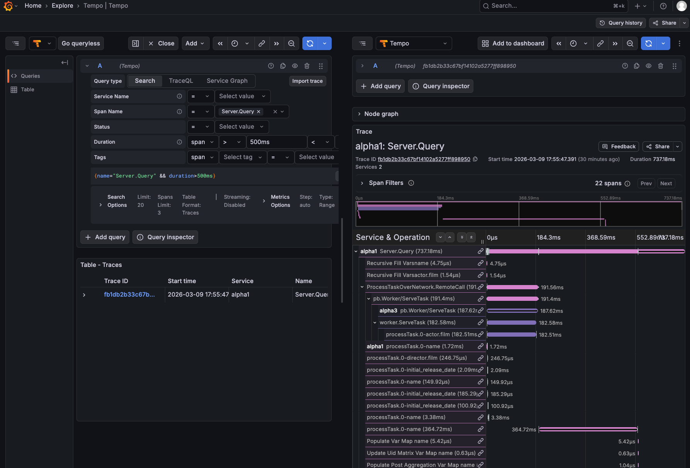
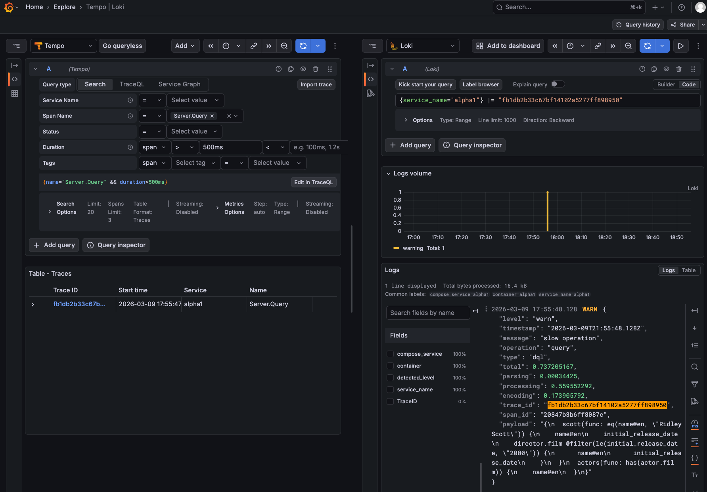

# Dgraph Observability Stack

A complete Grafana LGTM observability stack (Loki, Grafana, Tempo, Prometheus) with OpenTelemetry for monitoring any Dgraph cluster — local or external.

Note, this is for illustrative purposes only. The Loki and Promtail configurations herein should be examined carefully for
correct configuration.

## Architecture

```text
              ┌──────────────────────────────────────┐
              │           Dgraph Cluster             │
              │     (local overlay or external)      │
              │                                      │
              │  ┌──────────┐      ┌──────────┐      │
              │  │ Zero(s)  │◄────►│ Alpha(s) │      │
              │  └────┬─────┘      └────┬─────┘      │
              │       │                 │            │
              │   - /metrics           - /metrics    │
              │   - OTLP traces        - OTLP traces │
              │       │                 │            │
              └───────┼─────────────────┼────────────┘
                      │                 │
                      └────────┬────────┘
                               │
                 ┌─────────────┼──────────────┐
                 │             │              │
         /metrics endpoints    │    Docker socket API
                 │         OTLP traces        │
                 │         (port 4318)        │
                 ▼             │               ▼
┌──────────────────┐           │       ┌──────────────────┐
│  Prometheus      │           ▼       │  Promtail        │
│  :9090           │  ┌──────────────┐ │                  │
│                  │  │ OTel         │ │  Docker API      │
│  scrapes /metrics│  │ Collector    │ │  log collection  │
│  via file_sd     │  │ :4317 (gRPC) │ │  Logs → Loki     │
│  (dgraph.json)   │  │ :4318 (HTTP) │ │                  │
│                  │  │              │ └────────┬─────────┘
│                  │  │ Traces→Tempo │          │
└────────┬─────────┘  └──────┬───────┘          │
         │                   │                  │
         ▼                   ▼                  ▼
┌────────────────────────────────────────────────────────┐
│                     Grafana :3000                      │
│                                                        │
│  Datasources:                                          │
│   • Prometheus → Metrics dashboards                    │
│   • Tempo → Distributed traces (TraceQL)               │
│   • Loki → Log exploration                             │
│                                                        │
│  Pre-built Dashboard: Dgraph Cluster Overview          │
└────────────────────────────────────────────────────────┘
```

## Quick Start

### Mode 1: Bundled Local Dgraph Cluster

Spins up a single-node Dgraph cluster alongside the monitoring stack:

```bash
docker compose -f docker-compose.yml -f docker-compose.dgraph.yml up -d
```

### Mode 2: Existing Dgraph Cluster (same Docker host)

Attach monitoring to a Dgraph cluster already running in another Compose project:

```bash
# 1. Generate Prometheus targets from the Dgraph compose file
./generate-targets.sh /path/to/dgraph/docker-compose.yml

# 2. Find the Dgraph cluster's Docker network
docker network ls | grep <project-dir>

# 3. Start monitoring attached to that network
DGRAPH_NETWORK=<network_name> \
  docker compose -f docker-compose.yml -f docker-compose.network.yml up -d
```

The Dgraph cluster must already be running (the network is declared `external`).

### Mode 3: Remote Dgraph Cluster

For a Dgraph cluster on a different host:

```bash
# 1. Edit targets manually with the remote addresses
vim prometheus/targets/dgraph.json

# 2. Start the monitoring stack
docker compose up -d
```

Uncomment the OTel Collector port mappings in `docker-compose.yml` (ports `4317` and `4318`) so remote nodes can reach the collector.

Configure the remote Dgraph nodes to send traces to this host:
```sh
--trace "jaeger=<monitoring-host>:4318; ratio=1.0; service=alpha1;"
```

> **Note:** Promtail log collection only works for containers on the same Docker host.

After starting, open **Grafana** at [http://localhost:3000](http://localhost:3000) and sign in with `admin` / `admin`.

## Services & Ports

| Service          | Port | Description                    |
|------------------|------|--------------------------------|
| Grafana          | 3000 | Dashboards & visualization     |
| Prometheus       | 9090 | Metrics storage & query        |
| Tempo            | 3200 | Trace storage HTTP API         |
| Loki             | 3100 | Log storage HTTP API           |
| OTel Collector   | 4317 | OTLP gRPC receiver (internal)  |
| OTel Collector   | 4318 | OTLP HTTP receiver (internal)  |
| OTel Collector   | 8888 | Collector self-metrics (internal) |

> **Note:** OTel Collector ports are only accessible within Docker by default. Uncomment the `ports` section in `docker-compose.yml` if you need host access (e.g., Mode 3).

When using the local Dgraph overlay (`docker-compose.dgraph.yml`):

| Service      | Port | Description                        |
|--------------|------|------------------------------------|
| Dgraph Alpha | 8080 | HTTP API (GraphQL, DQL, metrics)   |
| Dgraph Alpha | 9080 | gRPC API                           |
| Dgraph Zero  | 5080 | Internal gRPC                      |
| Dgraph Zero  | 6080 | HTTP API (admin, metrics)          |

## What Gets Collected

### Metrics (Prometheus)

Prometheus scrapes `/metrics` from Alpha and Zero nodes using `file_sd_configs`. Targets are defined in `prometheus/targets/dgraph.json` and auto-reloaded every 30 seconds.

Key metric families:

- **`dgraph_latency_bucket`** — Query and mutation latency histograms
- **`dgraph_num_queries_total`** — Total query count (by status: ok/error)
- **`dgraph_num_mutations_total`** — Total mutation count
- **`dgraph_txn_commits_total` / `_aborts_total` / `_discards_total`** — Transaction outcomes
- **`dgraph_pending_queries_total`** — In-flight queries
- **`dgraph_pending_proposals_total`** — Pending Raft proposals
- **`dgraph_memory_*_bytes`** — Memory allocation (inuse, idle, proc, alloc)
- **`dgraph_disk_*_bytes`** — Disk usage (used, free, total)
- **`dgraph_raft_*`** — Raft consensus metrics (leader, applied index, changes)
- **`dgraph_alpha_health_status`** — Alpha health check status
- **`dgraph_hit_ratio_*`** — Cache hit ratios
- **`badger_*`** — Badger storage engine metrics (reads, writes, LSM, vlog, compaction)
- **`go_*`** — Go runtime metrics (goroutines, memory, GC)
- **`process_*`** — OS process metrics (CPU, memory, file descriptors)



### Traces (Tempo via OpenTelemetry)

Dgraph Alpha and Zero send OTLP traces to the OpenTelemetry Collector, which forwards them to Tempo.

Configured via the `--trace` flag on each Dgraph node:
```sh
--trace "jaeger=otel-collector:4318; ratio=1.0; service=alpha1;"
```

- **`ratio=1.0`** sends 100% of traces (reduce in production, e.g. `0.01` for 1%)
- **`service=...`** sets the trace service name for filtering in Grafana
- Tempo generates **span metrics** and **service graphs** automatically, written back to Prometheus



### Logs (Loki via Promtail)

Promtail collects Docker container logs via the Docker API and ships them to Loki:

- Uses Docker service discovery to find containers automatically
- Filters containers by Docker Compose service name (matching `alpha*` and `zero*` services)
- Extracts labels: `container`, `service`, `compose_service`, `service_name`
- Grafana's Loki datasource is configured with a derived field to link trace IDs in logs to Tempo

## generate-targets.sh

Auto-generates Prometheus scrape targets from any Dgraph `docker-compose.yml`:

```bash
./generate-targets.sh <docker-compose.yml> [cluster-name]
```

The script:
1. Parses the compose file using `docker compose config`
2. Finds all Dgraph Alpha and Zero services
3. Extracts hostnames and ports from `--my=host:port` flags
4. Calculates HTTP/metrics ports (internal port + 1000)
5. Writes `prometheus/targets/dgraph.json`

**Requirements:** `docker` (Compose v2), `jq`

Example output for a 3-Alpha, 1-Zero cluster:
```bash
Generated prometheus/targets/dgraph.json:
  alpha1: alpha1:8180 (alpha)
  alpha2: alpha2:8182 (alpha)
  alpha3: alpha3:8183 (alpha)
  zero1: zero1:6180 (zero)
```

## Pre-built Dashboard

The **Dgraph Cluster Overview** dashboard is auto-provisioned and includes:

| Section                      | Panels                                                       |
|------------------------------|--------------------------------------------------------------|
| Cluster Health               | Alpha health, Raft leader status, leader changes, max TS     |
| Query & Mutation Throughput  | Query rate, mutation/edge rate, latency percentiles (p50/90/99) |
| Transactions                 | Commit/abort/discard rates, pending operations               |
| Memory                       | Dgraph memory breakdown, Go runtime heap                     |
| Badger Storage Engine        | I/O throughput, operations rate, storage size, compactions    |
| Disk & Cache                 | Disk usage, cache hit ratios                                 |
| Go Runtime                   | Goroutine counts, CPU time                                   |
| Logs                         | Live log stream from Loki                                    |

## Configuration

### Trace Sampling

The default config sends **100% of traces** (`ratio=1.0`). For production, lower the ratio:

```sh
--trace "jaeger=otel-collector:4318; ratio=0.01;"  # 1% sampling
```

### Prometheus Targets

Targets are defined in `prometheus/targets/dgraph.json` using Prometheus `file_sd_configs`. Edit this file directly or use `generate-targets.sh`. Changes are picked up automatically within 30 seconds — no restart needed.

### Dgraph Image

When using the local Dgraph overlay, set the image via environment variable:

```bash
DGRAPH_IMAGE=dgraph/dgraph:v25.3.0 \
  docker compose -f docker-compose.yml -f docker-compose.dgraph.yml up -d
```

Default: `dgraph/dgraph:local`

### Data Retention

| Component   | Default Retention | Config Location                  |
|-------------|-------------------|----------------------------------|
| Prometheus  | 30 days           | `docker-compose.yml` (CLI flag)  |
| Tempo       | 72 hours          | `tempo/tempo.yaml`               |
| Loki        | No limit (dev)    | `loki/loki.yaml`                 |

## Exploring Data in Grafana

### Metrics (Explore → Prometheus)

```promql
# Query rate over time
rate(dgraph_num_queries_total{status="ok"}[5m])

# P99 query latency
histogram_quantile(0.99, rate(dgraph_latency_bucket{method="query"}[5m]))

# Transaction abort ratio
rate(dgraph_txn_aborts_total[5m]) / rate(dgraph_txn_commits_total[5m])
```

### Traces (Explore → Tempo)

Sign in as `admin` to access Explore. Select **Tempo** as the datasource.

Use TraceQL to search traces:
```logql
{}                                                    # All recent traces
{resource.service.name = "alpha1"}                    # Filter by service
{resource.service.name = "alpha1" && duration > 100ms}  # Slow traces
{resource.service.name = "alpha1" && status = error}    # Errors
```

Or use the **Search** tab to browse by service name and duration.

When combined with the Dgraph alpha `log-slow-query-threshold` configuration (v25.3+), you can correlate slow queries with trace data to identify performance bottlenecks.



### Logs (Explore → Loki)

```logql
{compose_service=~"alpha.*|zero.*"}          # All Dgraph logs
{compose_service="alpha1"} |= "error"        # Alpha1 errors
{compose_service="zero1"} |= "raft"          # Zero1 Raft messages
{container="alpha1"} | json | level="ERROR"  # Structured log search
```

## Troubleshooting

### No metrics in Prometheus

```bash
# Check Prometheus targets page
open http://localhost:9090/targets

# Verify the targets file
cat prometheus/targets/dgraph.json

# Test a metrics endpoint directly
curl -s http://localhost:8080/metrics | head -20
```

### No traces in Tempo

```bash
# Check OTel Collector logs
docker compose logs otel-collector --tail 20

# Check Tempo logs for ring/ingester errors
docker compose logs tempo --tail 20

# Verify Tempo is healthy
curl http://localhost:3200/ready
```

### No logs in Loki

```bash
# Check Promtail logs — look for "added Docker target" messages
docker compose logs promtail --tail 20

# Verify Loki has labels
curl http://localhost:3100/loki/api/v1/labels

# Check which containers Promtail is tracking
# (containers must have compose service names matching alpha* or zero*)
```

### Network issues (Mode 2)

```bash
# Verify the Dgraph network exists
docker network ls | grep default

# Check that monitoring services are on the Dgraph network
docker network inspect <network_name> | grep -A2 "otel-collector\|prometheus"
```

### Reset everything

```bash
docker compose down -v  # -v removes volumes (all stored data)
docker compose up -d
```

## File Structure

```sh
monitoring/
├── docker-compose.yml              # Monitoring stack (no Dgraph)
├── docker-compose.dgraph.yml       # Local Dgraph cluster overlay
├── docker-compose.network.yml      # External Dgraph network overlay
├── generate-targets.sh             # Auto-generate Prometheus targets
├── .env.example                    # Environment variable reference
├── README.md
├── grafana/
│   ├── dashboards/
│   │   └── dgraph-overview.json    # Pre-built Dgraph dashboard
│   └── provisioning/
│       ├── dashboards/
│       │   └── dashboards.yaml     # Dashboard auto-provisioning
│       └── datasources/
│           └── datasources.yaml    # Datasource auto-provisioning
├── loki/
│   └── loki.yaml                   # Loki configuration
├── otel-collector/
│   └── config.yaml                 # OTel Collector config (traces only)
├── prometheus/
│   ├── prometheus.yml              # Prometheus scrape config
│   └── targets/
│       └── dgraph.json             # Dgraph scrape targets (file_sd)
├── promtail/
│   └── promtail.yaml               # Promtail log collection config
├── tempo/
│   └── tempo.yaml                  # Tempo configuration (v2.6.x)
└── images/                          # README screenshots
```
